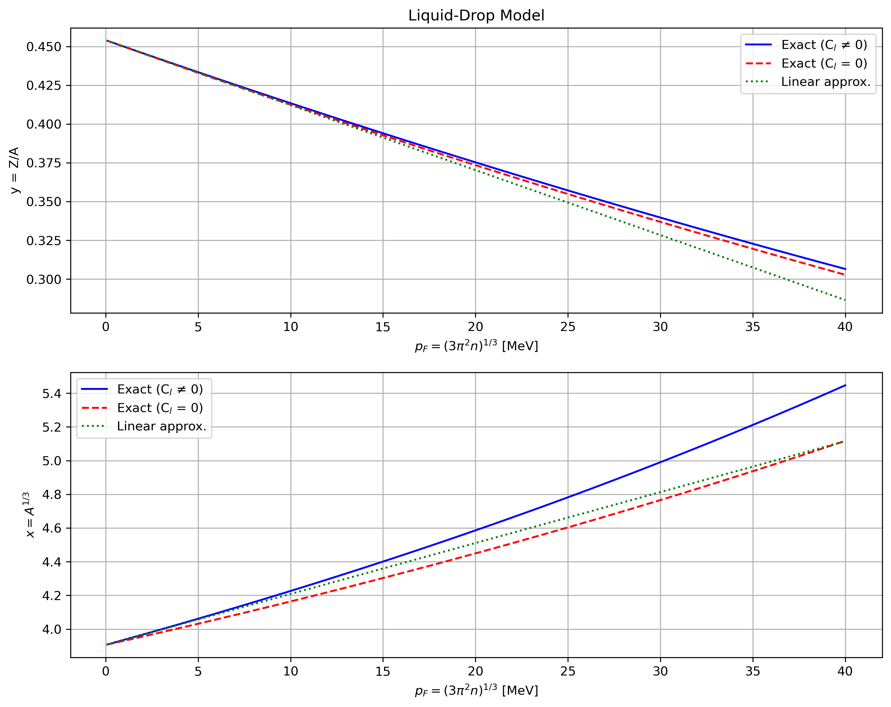
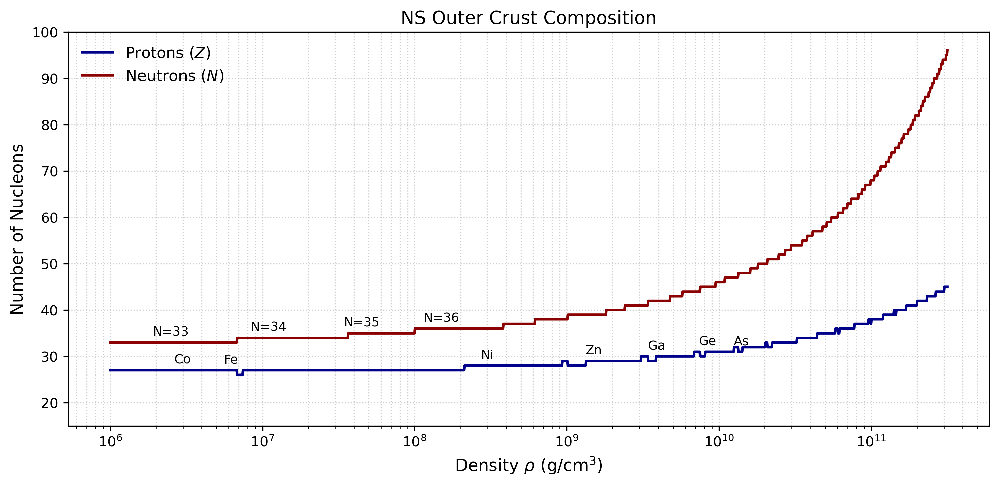

# Exercise 2 - Neutron Star Outer Crust Composition

**AUTh - Aristotle University of Thessaloniki**  
**Physics Department**  
**Author:** Konstantinos E. Stergiou  
**Date:** 3 June, 2025  

---

## 📋 Table of Contents

- [Introduction](#introduction)
- [Complete Python Script](#complete-python-script)
- [Step-by-Step Breakdown](#step-by-step-breakdown)
  - [Cell 1: Libraries](#cell-1-libraries)
  - [Cell 2: Constants](#cell-2-constants)
  - [Cell 3: Base Equations](#cell-3-base-equations)
  - [Cell 4: Lattice-Modified Equations](#cell-4-lattice-modified-equations)
  - [Cell 5: Linear Approximation](#cell-5-linear-approximation)
  - [Cell 6: Plotting](#cell-6-plotting)
  - [Cell 7: Density Calculations](#cell-7-density-calculations)
  - [Cell 8: Crust Composition Plot](#cell-8-crust-composition-plot)
- [Results](#results)

---

## 📘 Introduction

This project models the composition of a neutron star's outer crust using the liquid-drop model with lattice corrections. Key features:

### 🔑 Key points

- **Model:** Liquid-drop nuclear binding energy with Coulomb lattice terms  
- **Input:** Fermi momentum range (0.1–40 MeV)  
- **Output:** Optimal (A, Z) pairs vs. density  
- **Visualization:** Proton/neutron numbers vs. logarithmic density  

---

## 💻 liquid_drop_model.ipynb

### Importing Libraries

We start by importing the required libraries:  
`numpy`, `matplotlib.pyplot`, `pandas`, and `scipy.optimize`.

### Defining Constants

We define the constants used in the semi-empirical mass formula, as well as physical constants like particle masses, conversion factors, and the lattice correction.

```python

## Cell 1

import numpy as np
import matplotlib.pyplot as plt
import pandas as pd
from scipy.optimize import root
from scipy.optimize import fsolve
```

```python
## Cell 2

a_v = 15.71511  # MeV
a_s = 17.53638  # MeV
a_c = 0.71363   # MeV
a_a = 23.37837  # MeV

C_l = 3.40665e-3  # Lattice constant

m_n = 939.565   # MeV, neutron mass
m_p = 938.272   # MeV, proton mass
dm = m_n - m_p

m = 939         # MeV, mean baryon mass
g_cm3_to_MeV4 = 4.24742944e-6  # units conversion
rho_drip = 4e11  # g/cm3 density drip point
``` 

---

### Solving the Liquid-Drop Model

The composition of the outer crust is determined by the nucleus that minimizes the total energy per nucleon. Before neutron drip, this energy is composed of three terms:
  
**$ε(A, Z; n) = ε_n + ε_e + ε_l$**  
  
In this simplified case, we consider only the **nuclear contribution** εₙ, using the liquid-drop model:
  
**$ε_n(x, y) = m_py + m_n(1−y) − a_υ + \dfrac{a_s}{x} + a_c·x²·y² + a_α·(1−2y)^2$**  

where:  
- **$x = A^{1/3}$**,  
- **$y = Z/A$** is the proton (or electron) fraction.

To find the equilibrium composition, we solve the system of equations obtained by setting the partial derivatives of εₙ with respect to x and y to zero:

**$(\dfrac{\partial ε_n}{\partial x})_y = −\dfrac{a_s}{x^2} + 2a_cxy² = 0$**  
**$(\dfrac{\partial ε_n}{\partial y})_x = −Δm + 2a_cx^2y − 4a_α(1−2y) = 0$**  

This is solved numerically using `fsolve`.


```python
## Cell 3

def equations(p):
    x, y = p
    eq1 = -a_s / (x**2) + 2 * a_c * x * y**2
    eq2 = -dm + 2 * a_c * x**2 * y - 4 * a_a * (1 - 2*y)
    return [eq1, eq2]

initial_guess = [4.0, 0.5]

x_sol, y_sol = fsolve(equations, initial_guess)

A0 = x_sol ** 3
Z0 = y_sol * A0

print(f"x0 = {x_sol:.5f}")
print(f"y0 = {y_sol:.5f}")
print(f"A0 = {A0:.4f}")
print(f"Z0 = {Z0:.4f}")
```
Output:
x0 = 3.90612
y0 = 0.45405
- Derived values:
  * Mass number A0 = 59.60
  * Proton number Z0 = 27.06

The derived value $Z_0 \approx 27$ is very close to the expected value of 26, corresponding to iron $^{26}Fe$, which is energetically favored at low densities.

---

### Including Electron and Lattice Contributions

We now compute more accurate solutions by incorporating the contributions from both **degenerate electrons** and the **Coulomb lattice**. Specifically, we solve the system for two cases:  
- One **with** lattice corrections, and  
- One **without** lattice corrections.

Incorporating electronic and lattice contributions to the
semiempirical mass formula yields the following expression
for the total energy per nucleon of the system:

**$ε_n(x, y, p_F) = m_py + m_n(1−y) − a_υ + \dfrac{a_s}{x} + a_cx^2y^2 + a_α(1−2y)^2 + \dfrac{3}{4}y^{4/3}p_F - C_lx^2y^2p_F$** 

As in the case of the pure nuclear contribution, the optimal values of x and y for a given density are determined by setting 
both partial derivatives of the total energy per nucleon equal to zero.


**$\left( \dfrac{\partial ε}{\partial x} \right)_{y, p_F} = -\dfrac{a_s}{x^2} + 2\tilde{a}_c x y^2 = 0$**

**$\left( \dfrac{\partial ε}{\partial y} \right)_{x, p_F} = -\Delta m + 2\tilde{a}_c x^2 y - 4a_α (1 - 2y) + y^{1/3} p_F = 0$**

where a “renormalized” Coulomb coefficient has been defined as **$\tilde{a}_c(p_F) = a_c - C_lp_F$**. Without lattice corrections ( **$\tilde{a}_c = a_c$** ) the system is the same but without the lattice-renormalized term.

We solve this system numerically for a range of electron Fermi momenta **$p_F \in [0.1, 40] MeV$**, computing the optimal values of x and y, and from them the corresponding values of mass number **$A = x^3$**  and proton number **$Z = yA$** .

```python
## Cell 4

def equations_with_lattice(p, pF):
    x, y = p
    a_c_renorm = a_c - C_l * pF  # renormalized a_c (with Lattice)
    eq1 = -a_s / (x**2) + 2 * a_c_renorm * x * y**2                              # (6ε/6x)_y = 0
    eq2 = -dm + 2 * a_c_renorm * x**2 * y - 4 * a_a * (1 - 2*y) + y**(1/3) * pF  # (6ε/6y)_x = 0
    return [eq1, eq2]

def equations_no_lattice(p, pF):
    x, y = p
    a_c_renorm = a_c  # without Lattice, a_c(pF) = a_c
    eq1 = -a_s / (x**2) + 2 * a_c_renorm * x * y**2                              # (6ε/6x)_y = 0
    eq2 = -dm + 2 * a_c_renorm * x**2 * y - 4 * a_a * (1 - 2*y) + y**(1/3) * pF  # (6ε/6y)_x = 0
    return [eq1, eq2]

pF_range = np.linspace(0.1, 40, 100)  # MeV

initial_guess = [4.0, 0.5]  # x ~ A^(1/3), y ~ Z/A

results_with = {'x': [], 'y': [], 'A': [], 'Z': []}
results_no = {'x': [], 'y': [], 'A': [], 'Z': []}

for pF in pF_range:
    # with Lattice
    x_sol, y_sol = fsolve(equations_with_lattice, initial_guess, args=(pF,))
    results_with['x'].append(x_sol)
    results_with['y'].append(y_sol)
    results_with['A'].append(x_sol**3)
    results_with['Z'].append(y_sol * x_sol**3)
    
    # without Lattice
    x_sol, y_sol = fsolve(equations_no_lattice, initial_guess, args=(pF,))
    results_no['x'].append(x_sol)
    results_no['y'].append(y_sol)
    results_no['A'].append(x_sol**3)
    results_no['Z'].append(y_sol * x_sol**3)
```
---
We also provide a linear approximation for the solution (x, y), valid for small **$p_F$**, around the equilibrium values **$x_0 = 3.90612$** and **$y_0 = 0.45405$**. The corrections **$\xi$** and **$\eta$** to x and y, respectively, are given by:

**$\xi = \left( \dfrac{(C_1 - 1)C_l + 2C_2}{3C_1 - 1} \right) \cdot \dfrac{p_F}{a_c}$**  
**$\eta = - \left( \dfrac{3C_2 - C_l}{3C_1 - 1} \right) \cdot \dfrac{p_F}{a_c}$**

with:

**$C_1 = \dfrac{4a_a}{x_0^2 a_c}$**,  
**$C_2 = \dfrac{1}{2 x_0^2 y_0^{2/3}}$**

Thus, the linear estimates for x and y become:

**$x = x_0(1 + \xi)$**,  
**$y = y_0(1 + \eta)$**


```python
## Cell 5

def linear_approx(p_F):
    x0 = 3.90612
    y0 = 0.45405
    C1 = 4*a_a / (x0**2 * a_c)
    C2 = 1 / (2 * x0**2 * y0**(2/3))
    xi = ((C1 - 1)*C_l + 2*C2) / (3*C1 - 1) * (p_F/a_c)
    eta = - (3*C2 - C_l) / (3*C1 - 1) * (p_F/a_c)
    return x0*(1 + xi), y0*(1 + eta)

x_linear, y_linear = linear_approx(pF_range)
```

---

### Liquid-Drop Model Results

In this plot, we show how the equilibrium values of $x = A^{1/3}$ and $y = Z/A$ vary as a function of Fermi momentum $p_F = (3\pi^2 n)^{1/3}$. We compare:

- **Exact solution including Coulomb lattice effects**: $C_l \ne 0$ (blue solid line)  
- **Exact solution without Coulomb lattice**: $C_l = 0$ (red dashed line)  
- **Linear approximation**: valid for small $p_F$ (green dotted line)

Top panel:
- Proton fraction $y = Z/A$ vs $p_F$

Bottom panel:
- Mass number scaling $x = A^{1/3}$ vs $p_F$

The figure illustrates how the lattice contribution affects the equilibrium composition of the crust.




```python
## Cell 6

plt.figure(figsize=(10, 8))

# plot: y vs pF
plt.subplot(2, 1, 1)
plt.plot(pF_range, results_with['y'], label='Exact (C$_{l}$ ≠ 0)', color='blue')
plt.plot(pF_range, results_no['y'], label='Exact (C$_{l}$ = 0)', color='red', linestyle='--')
plt.plot(pF_range, y_linear, label='Linear approx.', color='green', linestyle=':')
plt.xlabel('$p_F=(3π^2n)^{1/3}$ [MeV]')
plt.ylabel('y = Z/A')
plt.legend()
plt.grid(True)
plt.title('Liquid-Drop Model')

# plot: x vs pF
plt.subplot(2, 1, 2)
plt.plot(pF_range, results_with['x'], label='Exact (C$_{l}$ ≠ 0)', color='blue')
plt.plot(pF_range, results_no['x'], label='Exact (C$_{l}$ = 0)', color='red', linestyle='--')
plt.plot(pF_range, x_linear, label='Linear approx.', color='green', linestyle=':')
plt.xlabel('$p_F=(3π^2n)^{1/3}$ [MeV]')
plt.ylabel('$x = A^{1/3}$')
plt.legend()
plt.grid(True)

plt.tight_layout()
plt.savefig('liquid_drop_model.png', dpi=300, bbox_inches='tight')
plt.show()
```

---

### Composition Across Density Range

To determine the equilibrium nuclear composition in the outer crust of a neutron star, we scan the Fermi momentum $p_F$ corresponding to a wide range of mass densities between $10^6$ and $5 \times 10^{11} \ \text{g/cm}^3$. These values include the region up to and slightly beyond the neutron drip point, as suggested by the reference paper.

We convert the mass density $\rho$ to number density $n = \rho/m$ (with $m$ being the average nucleon mass), and then compute the Fermi momentum using:

**$p_F = (3\pi^2 n)^{1/3}$**

For each value of $p_F$, we solve numerically for the equilibrium values of $x = A^{1/3}$ and $y = Z/A$, taking into account the Coulomb lattice correction ($C_l \ne 0$). From these, we reconstruct the integer values:

- Mass number: $A = x^3$
- Proton number: $Z = A \cdot y$
- Neutron number: $N = A - Z$

The table below shows representative values of $(p_F, A, Z, N)$ over the scanned density range:

|   pF [MeV]   |  A  |  Z  |  N  |
|:------------:|:---:|:---:|:---:|
|   0.511635   | 60  | 27  | 33  |
|   0.512717   | 60  | 27  | 33  |
|   0.513801   | 60  | 27  | 33  |
|   0.514887   | 60  | 27  | 33  |
|   0.515975   | 60  | 27  | 33  |
|     ...      | ... | ... | ... |
|  34.564108   | 139 | 45  | 94  |
|  34.637177   | 140 | 45  | 95  |
|  34.710399   | 140 | 45  | 95  |
|  34.783777   | 140 | 45  | 95  |
|  34.857309   | 141 | 45  | 96  |

This result reveals how the optimal nuclear species evolve as the density increases in the outer crust, up to the point where neutrons start to drip out of the nucleus.


```python
## Cell 7

# Densities' range
rho_gcm3 = np.logspace(6, 11.5, 2000)  # 10^6 to 5e11 g/cm³
rho_MeV4 = rho_gcm3 * g_cm3_to_MeV4

# Calculating n and p_F
n = rho_MeV4 / m
pfermi = (3 * np.pi**2 * n)**(1/3)

# Optimal (x, y) for rho limits
resfinal = []
for pf in pfermi:
    x,y = fsolve(equations_with_lattice,(3,3),args=(pf))
    A = int(x**3)
    Z = int(A*y) 
    N = A-Z
    resfinal.append({'pF': pf, 'A': A, 'Z': Z, 'N': N})

# DataFrame
dffinal = pd.DataFrame(resfinal)
dffinal
```

---

### Outer Crust Composition as a Function of Density

This plot shows the evolution of the nuclear composition in the outer crust of a neutron star as the mass density increases from $10^6$ to $5 \times 10^{11} \ \text{g/cm}^3$. Specifically, it tracks the number of protons $Z$ and neutrons $N$ in the equilibrium nucleus at each density point.

The Fermi momentum $p_F$ was calculated from the density via:

**$p_F = (3\pi^2 n)^{1/3}$**, where **$n = \rho/m$**

Then, for each $p_F$, we computed the optimal nucleus $(A, Z, N)$ by minimizing the liquid-drop model energy including lattice corrections.

```python
## Cell 8

# Generating plot
plt.figure(figsize=(10, 5), dpi=100)

plt.plot(rho_gcm3, dffinal['Z'], label=r'Protons ($Z$)', color='darkblue', linewidth=1.8)
plt.plot(rho_gcm3, dffinal['N'], label=r'Neutrons ($N$)', color='darkred', linewidth=1.8, linestyle='-')

plt.xscale('log')
plt.ylim([15, 100])

plt.xlabel(r'Density $\rho$ (g/cm$^3$)', fontsize=12)
plt.ylabel('Number of Nucleons', fontsize=12)
plt.title('NS Outer Crust Composition', fontsize=13)

plt.legend(loc='best', fontsize=11, frameon=False)
plt.grid(True, which='both', linestyle=':', linewidth=0.8, alpha=0.6)

# --- Labels over Z (Protons) ---
labels_Z = {
    3e6: 'Co', 6.2e6: 'Fe', 3e8: 'Ni', 1.5e9: 'Zn',
    3.9e9: 'Ga', 8.4e9: 'Ge', 1.4e10: 'As'
}
for xval, symbol in labels_Z.items():
    idx = (abs(rho_gcm3 - xval)).argmin()
    yval = dffinal['Z'].iloc[idx]
    plt.text(xval, yval + 1.5, symbol, fontsize=9, ha='center', color='black')

# --- Labels over N (Neutrons) ---
labels_N = {
    2.5e6: 'N=33', 1.1e7: 'N=34', 4.5e7: 'N=35', 1.5e8: 'N=36'
}
for xval, label in labels_N.items():
    idx = (abs(rho_gcm3 - xval)).argmin()
    yval = dffinal['N'].iloc[idx]
    plt.text(xval, yval + 1.5, label, fontsize=9, ha='center', color='black')

plt.tight_layout()
plt.savefig('outer_crust_comp.png', dpi=300, bbox_inches='tight')
plt.show()
```
#### Plot Features:
- The **blue line** shows the number of protons $Z$.
- The **red line** shows the number of neutrons $N$.
- Vertical **labels** indicate specific isotopes that appear at characteristic densities.

This provides insight into how nuclei become more neutron-rich with increasing density, approaching the neutron drip line.


